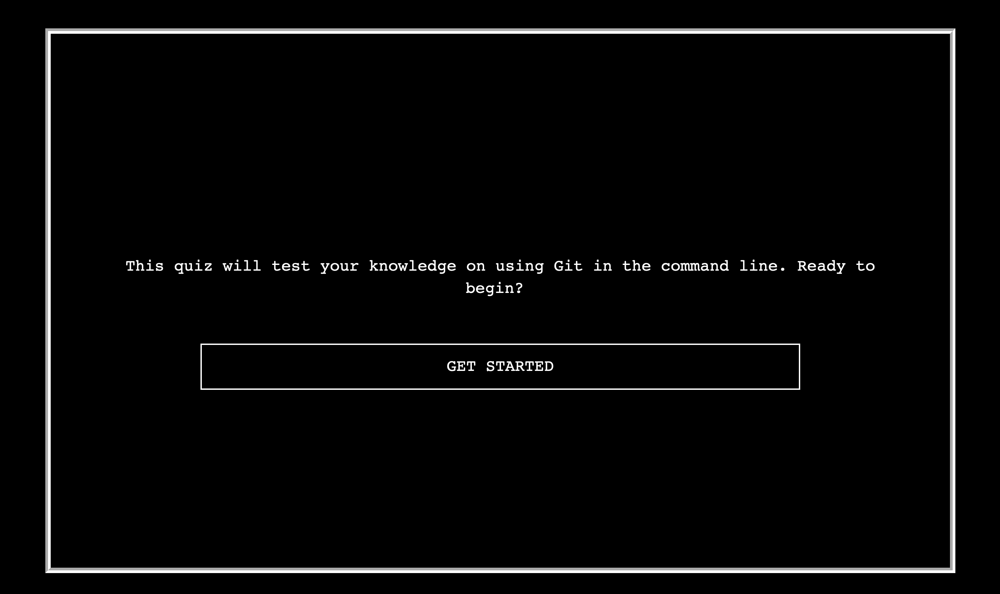
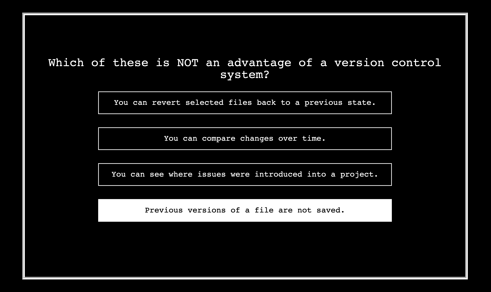

# Git Test

## Overview

A series of test questions on using Git in the command line.

## Description

I created this test as I quickly realized that there were many concepts in Git that I was unfamiliar with. So, I read through the documentation found here: https://git-scm.com/docs and created multiple choice questions to strengthen my understanding about Git. Because collaborating with other developers is such a fundamental skill in the tech industry today, it was incredibly beneficial for me to take the time to reinforce my understanding. 

I previously created a multiple choice test that used only front-end technologies, which meant that the questions were stored only in a front-end script file. This time, I decided to store the questions in a MySQL database to make the front-end script file more concise and so that correct answers aren't visible in the front-end source code. This was a great opportunity for me to refresh my skills in building full-stack applications with Node, MySQL, Handlebars, and Express. It was also a lot of fun for me to create a typing animation to make the UI more interesting.

Please find the deployed site here: https://git-test-13.herokuapp.com/

## Technologies Used

- HTML
- CSS
- JavaScript
- Handlebars
- Node
- Express
- MySQL

## Installation

No installation steps are required to view this project. To view the page, visit the URL above. The application's source code can be found on GitHub here: https://github.com/vruss14/git-test.

## Usage

This site is a series of questions about Git. It is not intended to be a complete or perfect assessment, and additional information about Git can be found through reading the documentation.

This web application includes responsive design and can be viewed on all devices.

Below are screenshots of the site:

## Credits

Valerie Russell was the sole contributor to this project. Contact her at vruss14@gmail.com.

### References

* [Git Reference Manual](https://git-scm.com/)
